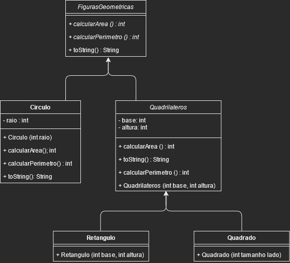

# Relatório Prático 1 PC2-2021-1
Nome: Everton Ferreira Carvalho

##  															Questionário 1 

#### Você fez uso do conceito de sobrecarga de funções? Onde?
Não.

#### Você fez uso do conceito de Herança de funções? Onde? Você vê que houve benefícios?
Sim, em todas as classes que herdam de BasicIO e em todas as classes que herdam de FiguraGeoemetrica. Sim, ajudou a diminuir a quantidade de codigo.

#### Você fez uso da função super() em construtores mesmo que indiretamente? Onde?
Sim, no construtor das classes BasicView, CirculoView, RetanguloView, QuadradoView, PainelDesenho, MainView, Retangulo, Quadrado, Quadrilateros é Circulo.

#### Você fez uso da função this() em construtores mesmo que indiretamente? Onde?
Não.

#### Você fez uso de sobreescrita de funções? onde? só de Object ou de alguma função sua mesmo?
Sim, Nas classes Circulo, FiguraGsGeometricas é Quaddrilateros. Eu sobrescrevi tanto funções de Object quanto funções criadas por mim mesmo.

#### Qual o benefício do uso de classes ENUM?
Faz com que o codigo se torne um pouco mais facil de ler.

#### Cole a imagem do diagrama de classe do seu sistema e faça um paragrafo se você entende este diagrama e ele representa realmente objetos do mundo real, com nomes de Metodos coerentes.

O diagrama mostram 3 Figuras Geoemetricas(Circulo, Quadrado e Retangulo) que são filhas da classe FiguraGeoemetrica e no caso do Retangulo e do Quadrado são filhas de Quadrilateros que herdam de FigurasGeoemetricas. Todos tem os metodos calcularArea é calcularPerimetro que permite calcular a area e o perimetro respectivamente.

#### Você fez uso da palavra Protected? Ela foi relevante onde?
Não

## 													Fase 2 e 3

## Na sua implementação do Trabalho 2 e 3:

#### Você acredita que o correto uso da Orientação à objetos traz mais benefícios ao seu código fonte?

Sim, pois ajuda na reutilização de codigos e tambem ajuda a facilitar a manutenção do mesmo.

#### O que é o tratamento de exceções e porque ele é necessário para a organização da transmissão de mensagens entre classes?

A exceção e um evento que pode acontecer e atrapalha o fluxo normal do programa. O tratamente dela e importante pois te permite tanto resolver ela e voltar ao fluxo normal ou avisar quem te chamou que determinado problema tem chance de acontecer.

#### Porque o uso de interfaces é útil no lugar do uso de Herança Multipla?

Porque ela te permite usar alguns dos beneficios da herança multipla sem alguns do seus possiveis problemas como o problema diamante ( quando uma classe filha tenta sobrescrever um metodo da classe pai porem não e possivel exatamente saber de  qual pai ela esta tentando sobrescrever ).

#### Você tem alguma classe que usa extends e  implements simultaneamente? se sim qual a justificativa para isso no  modelo do seu trabalho?

Não.

#### O que é UML e dentre os possíveis  diagramas existentes, cite 3 que poderiam ser úteis para descrever o seu projeto prático desta disciplina.

UML e um linguagem usada em varios tipos de diagrama relacionados a desenvolvimento e software. Diagrama de Atividades, diagrama de classes, diagrama de sequencia.

#### Do seu protótipo até esta etapa você  acabou fazendo uso de comportamentos Polimórficos no seu trabalho  prático. Qual foi o benefício sobre a visão de "Legibilidade" do código  fonte? E sobre "organização" das classes?

O polimorfismo me permitiu criar apenas uma unica lista para conter todos os objetos facilitando assim a legibilidade é a organização.
