# Relatório Prático 1 PC2-2021-1

Nome: Everton Ferreira Carvalho

## Questionário 1

#### Você fez uso do conceito de sobrecarga de funções? Onde?

Não.

#### Você fez uso do conceito de Herança de funções? Onde? Você vê que houve benefícios?

Sim, em todas as classes que herdam de BasicIO e em todas as classes que herdam de FiguraGeoemetrica. Sim, ajudou a
diminuir a quantidade de codigo.

#### Você fez uso da função super() em construtores mesmo que indiretamente? Onde?

Sim, no construtor das classes BasicView, CirculoView, RetanguloView, QuadradoView, PainelDesenho, MainView, Retangulo,
Quadrado, Quadrilateros é Circulo.

#### Você fez uso da função this() em construtores mesmo que indiretamente? Onde?

Não.

#### Você fez uso de sobreescrita de funções? onde? só de Object ou de alguma função sua mesmo?

Sim, Nas classes Circulo, FiguraGsGeometricas é Quaddrilateros. Eu sobrescrevi tanto funções de Object quanto funções
criadas por mim mesmo.

#### Qual o benefício do uso de classes ENUM?

Faz com que o codigo se torne um pouco mais facil de ler.

#### Cole a imagem do diagrama de classe do seu sistema e faça um paragrafo se você entende este diagrama e ele representa realmente objetos do mundo real, com nomes de Metodos coerentes.

O diagrama mostram 3 Figuras Geoemetricas(Circulo, Quadrado e Retangulo) que são filhas da classe FiguraGeoemetrica e no
caso do Retangulo e do Quadrado são filhas de Quadrilateros que herdam de FigurasGeoemetricas. Todos tem os metodos
calcularArea é calcularPerimetro que permite calcular a area e o perimetro respectivamente.

#### Você fez uso da palavra Protected? Ela foi relevante onde?

Não

## Fase 2 e 3

## Na sua implementação do Trabalho 2 e 3:

#### Você acredita que o correto uso da Orientação à objetos traz mais benefícios ao seu código fonte?

Sim, pois ajuda na reutilização de codigos e tambem ajuda a facilitar a manutenção do mesmo.

#### O que é o tratamento de exceções e porque ele é necessário para a organização da transmissão de mensagens entre classes?

A exceção e um evento que pode acontecer e atrapalha o fluxo normal do programa. O tratamente dela e importante pois te
permite tanto resolver ela e voltar ao fluxo normal ou avisar quem te chamou que determinado problema tem chance de
acontecer.

#### Porque o uso de interfaces é útil no lugar do uso de Herança Multipla?

Porque ela te permite usar alguns dos beneficios da herança multipla sem alguns do seus possiveis problemas como o
problema diamante ( quando uma classe filha tenta sobrescrever um metodo da classe pai porem não e possivel exatamente
saber de qual pai ela esta tentando sobrescrever ).

#### Você tem alguma classe que usa extends e implements simultaneamente? se sim qual a justificativa para isso no  modelo do seu trabalho?

Não.

#### O que é UML e dentre os possíveis  diagramas existentes, cite 3 que poderiam ser úteis para descrever o seu projeto prático desta disciplina.

UML e um linguagem usada em varios tipos de diagrama relacionados a desenvolvimento e software. Diagrama de Atividades,
diagrama de classes, diagrama de sequencia.

#### Do seu protótipo até esta etapa você acabou fazendo uso de comportamentos Polimórficos no seu trabalho  prático. Qual foi o benefício sobre a visão de "Legibilidade" do código  fonte? E sobre "organização" das classes?

O polimorfismo me permitiu criar apenas uma unica lista para conter todos os objetos facilitando assim a legibilidade é
a organização.

# Fase 5

## A ideia inicial

A ideia inicial do projeto era criar um pequeno software para gerir algumas categorias de dados (Texto, Reta, Triângulo,
Trapézio, Quadrado, Retângulo é Circulo)baseada no projeto original do Alessio. Cada um desses tipos deveria ter uma
espécie de submenu que permitia alterar, excluir, inserir, mostrar os detalhes de um unicos objeto e listar todos os
objetos do mesmo tipo.

O projeto foi divido em 5 camadas: o Model responsável pelos dados que definem o que é cada tipo, o View sendo responsável
pela forma de como o software se apresenta ao usuário, o Repository pela gestão na memória dos dados, o Dao pela
persistência e recuperamento dos dados gravados em disco é o controller por gerir o funcionamento do programa.

Diagrama de Classe
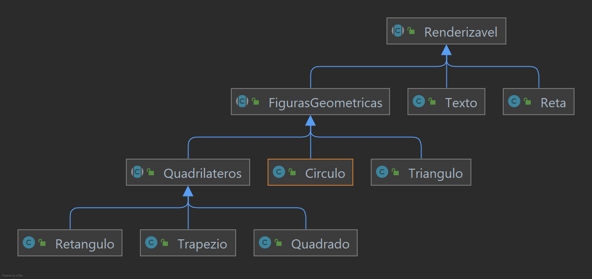

Diagrama de Sequencia da parte de escolha de interface do projeto
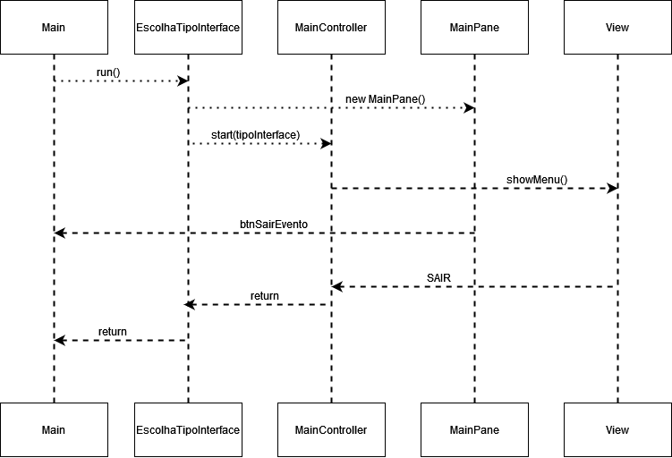

## Dependências

O projeto tem uma unica dependência, sendo uma dependência de desenvolvimento chamada Lombok. O Lombok através de
anotações auxilia a evitar códigos que são normalmente autogeradas pela IDE dos POJOs (construtor vazio, construtores
com todos os argumentos, getters, setters, equals é hashcode).

Exemplo de classe Circulo usando Lombok
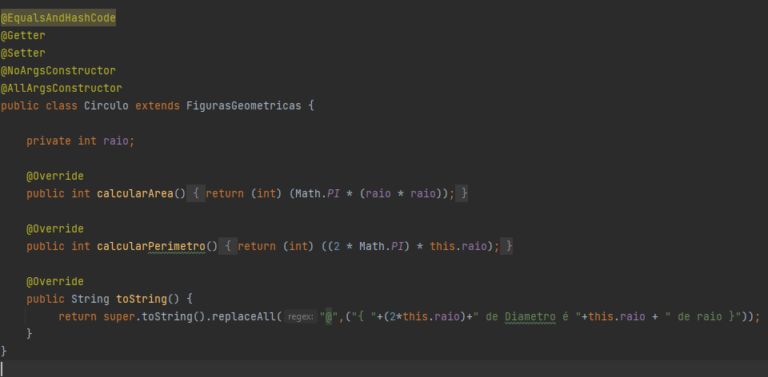

Exemplo de classe Circulo sem usar o Lombok
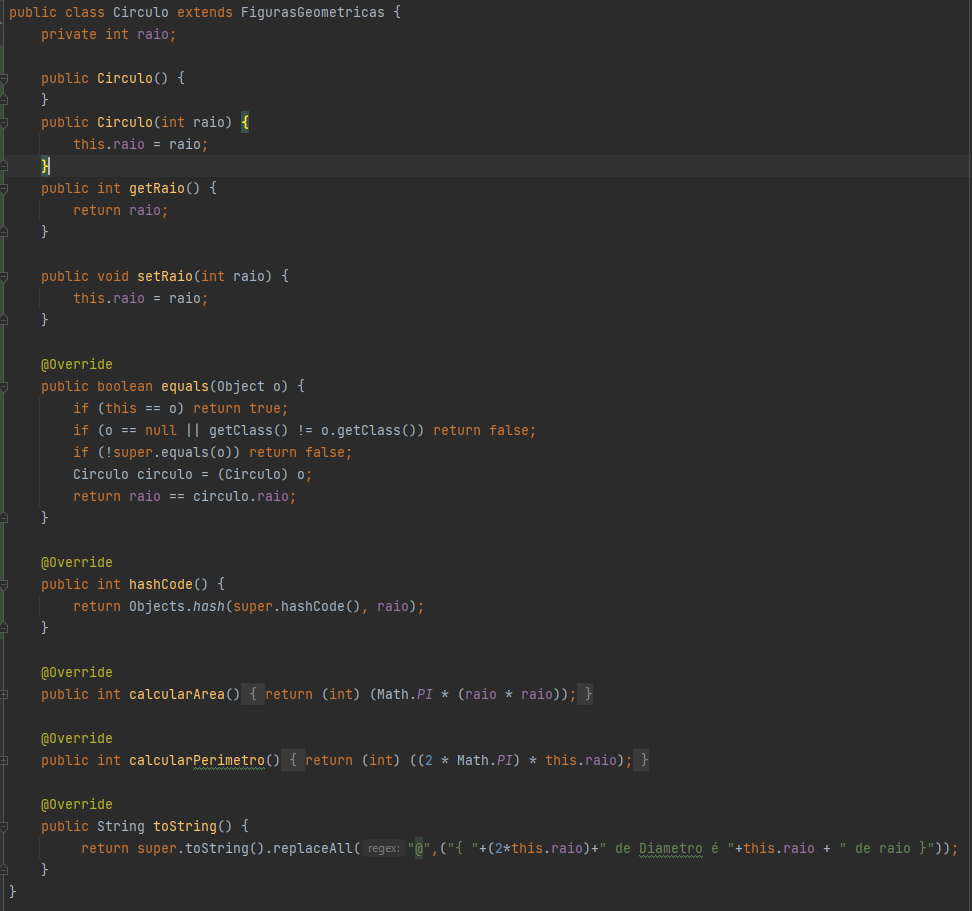

## Decisões importantes

A partir da Fase 4 eu decidi implementar 3 tipos de interface para o usuário, uma totalmente baseada no console, uma
gráfica porem a manter os controllers da mesma forma é uma terceira também gráfica porem voltada a eventos e com
controllers diferentes das outros 2 tipos de interface. Para selecionar o tipo de interface que o usuario deseja usar e
aberto um Dialog onde o mesmo deve selecionar qual ele gostaria de saber.

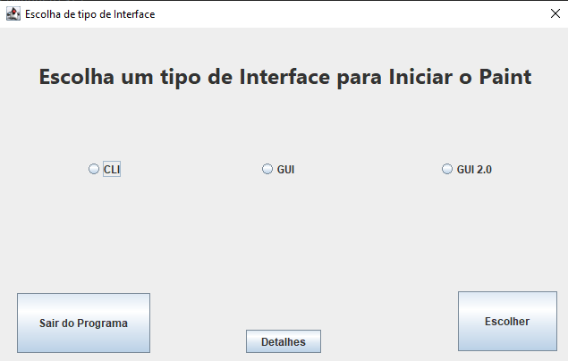

Nesta tela o usuário além de poder escolher qual interface que ele deseja usar, é também possivel ter uma breve
descrição da interface selecionando um dos tipos e clicando em detalhes.

## Funcionamento do Software

Apos o usuario selecionar a interface que ele deseja utilizar e passado o comando o para os seus respectivos controllers
e o software e iniciado.

### Interface GUI Padrão e Interface Console

    <figure style="margin: auto">
        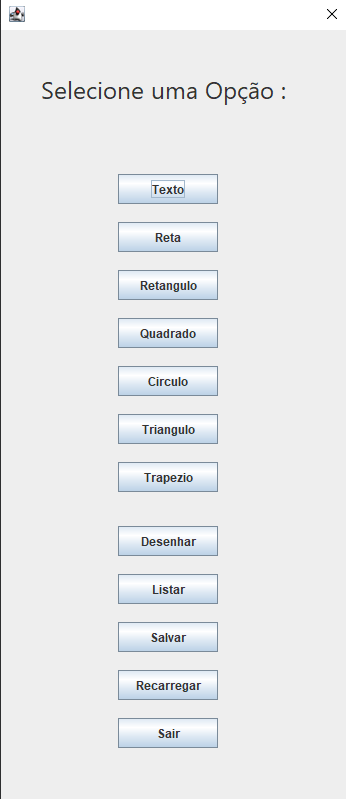
    </figure>
    <figure style="margin: auto">
        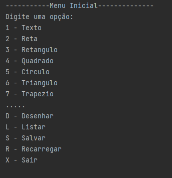
    </figure>

Ambas as interfaces têm o seu funcionamento bem-parecido, sendo a unica diferença e que no caso da interface gráfica
padrão os menus são renderizados em um JDialog ao inves de ser diretamente no console. Ao clicar em algum dos botões ou
digitar uma opção no caso do modo texto, e retornado um Enum ao controller que chama então o proximo menu conforme a
escolha.

    <figure style="margin: auto">
        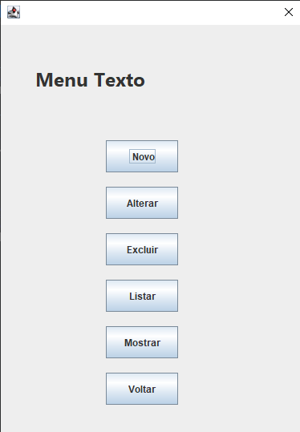
    </figure>
    <figure style="margin: auto">
        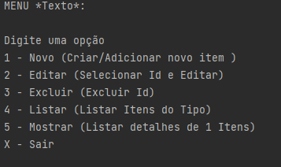
    </figure>

### Interface GUI 2

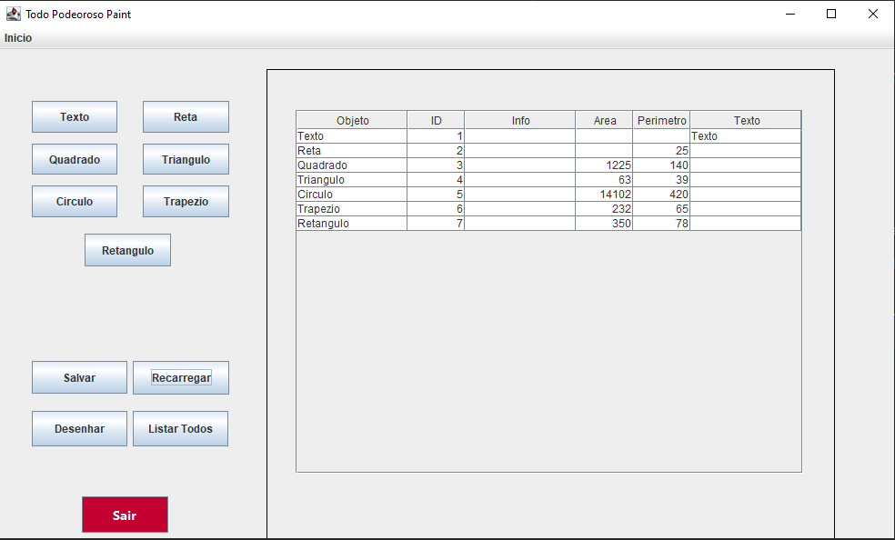

Na interface gráfica 2 é utilizado o CardLayout, é a interface funciona a sobrepor JPanes conforme as escolhas do
utilizador. Diferente das outras 2 interfaces, não existe uma chamada ao controller a cada opção que o usuário
seleciona. Essas chamadas so acontecem quando o usuario tenta Criar, Alterar, Excluir ou pesquisar algo específico do
banco. Na imagem abaixo a area marcada em vermelho e onde os submenus são renderizados e a area azul fica o menu
principal que não muda. Ao clicar em uma das opções nesse submenu e mostrado um JDialog com o formulario referente ao botão clicado.

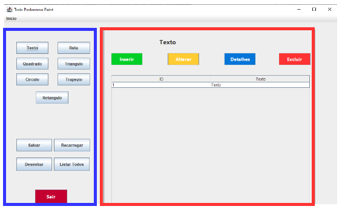

### Possiveis Mudanças que eu faria

Se eu fosse refazer o projeto de novo eu provavelmente teria feito os controllers mais parecidos com a da
interface gráfica 2 (no condigo eu chamei de GUI melhorada) deixando os controllers com uma cara mais parecida com um controller de uma API. No caso
o controller simplesmente processando as requisições do front, mas não necessariamente controlando cada passo
do front se e que você me entende. Deixando todo a parte do front bem mais parecida como uma SPA.

[comment]: # (comentarios.... caso vc abra o readme pela IDE)

[comment]: # (desculpa pelo portugues meio falhado)

[comment]: # (aquele botão Inicio que aparece ali na image e onde eu possivelmente iria implementar uma especie
de menu de configurações. Eu to deixando isso aqui em forma de comentario pq não sei se vou terminar de implementar
ate o momento em que vc vai corrigir)

